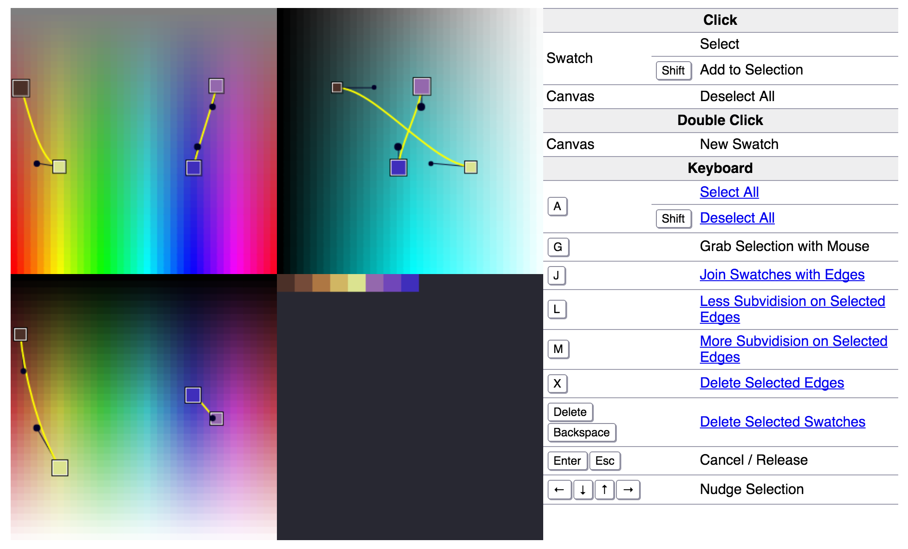

# Pal

**Pal** is a palette editor. I made it to help me design palettes for pixel art,
but I think it’s also suitable for general graphic design. It’s based on the
observation that an aesthetically pleasing and functional palette often
approximates a set of smooth curves through a colour space. So it allows you to
create 3D Bézier curves through HSL space, and interpolates along these curves
to generate the colour swatches that make up a palette.

## Screenshots

## Future Work

Pal is fairly useful as it stands, but is currently missing a number of niceties
that I’d like to add. In particular:

 * **Saving palettes** to various formats. At the moment, I just screenshot the
   generated palette and use the dropper tool in my graphics-editing
   application—short of perfect!

 * **Better sorting** of the generated palette, perhaps by projecting into a 2D
   arrangement rather than the current 1D, magnitude-based arrangement.

 * **More colour spaces**, such as HSV, CIE LAB, RGB, and CMYK. Some colour
   spaces produce better palettes than others, using Pal’s method—for example,
   RGB produces very poor results, although dualising a palette from a
   subtractive space to an additive space may yield very good results. The
   editor is also based on orthographic projection, which may become less
   intuitive in higher-dimensional colour spaces, depending on how well you deal
   with dimensions.

 * **More editing features**, such as drag-to-select, various transformations,
   undo/redo history, and contextual help.

## License

Pal is distributed under the terms of the MIT license, reproduced below.

Copyright (c) 2014 Jon Purdy

Permission is hereby granted, free of charge, to any person obtaining a copy of
this software and associated documentation files (the “Software”), to deal in
the Software without restriction, including without limitation the rights to
use, copy, modify, merge, publish, distribute, sublicense, and/or sell copies of
the Software, and to permit persons to whom the Software is furnished to do so,
subject to the following conditions:

The above copyright notice and this permission notice shall be included in all
copies or substantial portions of the Software.

THE SOFTWARE IS PROVIDED “AS IS”, WITHOUT WARRANTY OF ANY KIND, EXPRESS OR
IMPLIED, INCLUDING BUT NOT LIMITED TO THE WARRANTIES OF MERCHANTABILITY, FITNESS
FOR A PARTICULAR PURPOSE AND NONINFRINGEMENT. IN NO EVENT SHALL THE AUTHORS OR
COPYRIGHT HOLDERS BE LIABLE FOR ANY CLAIM, DAMAGES OR OTHER LIABILITY, WHETHER
IN AN ACTION OF CONTRACT, TORT OR OTHERWISE, ARISING FROM, OUT OF OR IN
CONNECTION WITH THE SOFTWARE OR THE USE OR OTHER DEALINGS IN THE SOFTWARE.
